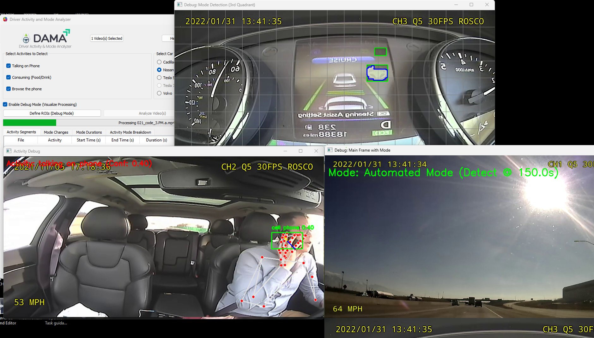

# Driver Activity and Mode Analyzer

The **Driver Activity and Mode Analyzer** is a Python-based tool that analyzes in-car driver videos to detect driver activities (e.g., talking on the phone, eating) and determine whether the vehicle is in **Automated** or **Manual** driving mode.  
It uses **computer vision**, **YOLOv8**, **MediaPipe**, and a **PyQt5 GUI** for an easy-to-use experience.



---

## ✨ Features
- **Driver Activity Detection**  
  Detects activities such as talking on the phone, browsing the phone, or consuming food/drink.  

- **Driving Mode Detection**  
  Determines Automated vs. Manual mode by identifying green steering wheel-like shapes in regions of interest (ROIs).  

- **User-Friendly GUI**  
  - Upload multiple video files  
  - Select activities to detect  
  - Choose a car type (e.g., Cadillac, Nissan, Tesla, Volvo)  
  - Debug mode for real-time visuals  
  - Results displayed in tables  

- **Result Summaries**  
  - Activity segments with timestamps  
  - Mode durations (Automated vs. Manual)  
  - Correlation of activities with driving modes  

---

## ⚙️ Requirements
- **Python** 3.8+ (tested on 3.11.9)
- **Hardware**:
  - NVIDIA CUDA-compatible GPU  
  - 8GB+ RAM (16GB recommended)  
  - Windows OS (default paths; adaptable for Linux/Mac)  

- **Dependencies**:
  ```bash
  pip install mediapipe ultralytics numpy PyQt5
  ```

- **Additional setup**:
  - Build OpenCV with CUDA support → [Guide](https://www.jamesbowley.co.uk/qmd/opencv_cuda_python_windows.html)  
  - Install PyTorch with CUDA (`torch`, `torchaudio`, `torchvision`) → [PyTorch Downloads](https://download.pytorch.org/whl/cu118/)  
  - Download YOLOv8 zero shot model: `yoloe-v8m-seg.pt` (auto-download via ultralytics or manually from [Ultralytics](https://github.com/ultralytics/ultralytics))  

---

## 🚀 Usage

1. **Activate your environment**
   ```bash
   cd C:\path to virtual env\Scripts
   activate.bat
   ```

2. **Run the script**
   ```bash
   cd C:\path to script
   python dama3.py
   ```

3. **GUI Controls**
   - **Upload Video(s)**: Select `.mp4`, `.avi`, or `.mov` files  
   - **Activities**: Choose detection options (e.g., Talking on Phone, Eating)  
   - **Car Type**: Select model (Nissan, Tesla S, Volvo, Cadillac)  
   - **Debug Mode**: Show real-time detections (slower)  
   - **Analyze Video(s)**: Start processing  

4. **Results** (shown in GUI):
   - Activity Segments (start/end times, duration)  
   - Activity by Mode (activity durations in Automated/Manual)  
   - Mode Durations (total time per mode)  

---

## 🛠️ Customization
- **Add a new car type** → Modify `rois_dict` in `VideoAnalyzer.__init__`  
- **Add a new activity** → Update GUI checkboxes + detection logic in `process_activity_batch`  
- **Adjust detection sensitivity** → Tweak thresholds in `check_green_steering_wheel` and `process_activity_batch`  
- **Change GUI layout** → Modify `VideoAnalyzer` class (PyQt5 components)  

---

## 🧩 Troubleshooting
- **No CUDA devices found** → Ensure NVIDIA drivers, CUDA Toolkit, and DLL paths are correct  
- **Video won’t open** → Check file path/format (`.mp4`, `.avi`, `.mov`)  
- **Missed detections** → Enable debug mode, adjust thresholds/ROIs  
- **GUI freezes** → Lower `YOLO_BATCH_SIZE` (default: 96 → try 32)  
- **Error loading YOLO model** → Ensure `yolov8m.pt` is present or downloaded  

---

## 🚧 Future Improvements
- Support more activities (e.g., looking away, adjusting radio)  
- Multi-GPU processing and async optimization  
- Cross-platform support (Linux/Mac)  
- Export results as CSV, add video playback in GUI  
- Better robustness in variable lighting conditions  

---

## 📸 ROI Examples
The documentation includes ROI examples for:  
- **Nissan Rogue**  
- **Tesla Model S**  
- **Volvo XC90**  
- **Cadillac**  

---

## 📖 License
Human Systems Lab License (www.hslab.org)

---

## 🙌 Acknowledgements
- [Ultralytics YOLOv8](https://github.com/ultralytics/ultralytics)  
- [MediaPipe](https://developers.google.com/mediapipe)  
- [OpenCV](https://opencv.org/)  
- [PyQt5](https://riverbankcomputing.com/software/pyqt/intro)  

---

## 📄 Documentation
For detailed usage, modification, and ROI reference images, see [`documentation.pdf`](./documentation.pdf).
